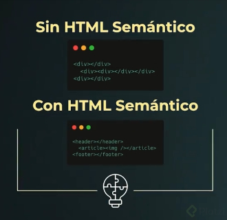

# Guía de accesibilidad para la web

## Que es la accesibilidad.

Es la práctica continua de asegurarnos que todo lo que creamos para la web se puede usar, interpretar y operar por una variedad de personas en una variedad de situaciones.

## WCAG y sus criteros de conformidad.

WACG. Es una división perteneciente a la w3c la cual regula los estandares de accesibilidad en la web. Tambien son pertenecientes a la WAI (Web Accesibility Initiative) dentro de la W3C.

WACG presenta 12 criterios de conformidad que todos los productos digitales en la web deberian cumplir, estos criterios se dividen en tres niveles de trabajo en el ambito de accesibilidad:

A: nivel basico
AA: nivel intermedio
AAA: nivel avanzado se debe apuntar si se trabaja en servicios del gobierno, universidades o servicios esenciales de la vida cotidiana.

WACG tambien presenta cuatro principios bajo los cuales se construyen los criterios de conformidad, estos son:

### Perceptible

La información y los componentes de la interfaz de usuario deben poder presentarse a los usuarios de manera que puedan percibirlos.

Esto significa que los usuarios deben poder percibir la información que se presenta (no puede ser invisible para todos sus sentidos)

### Operable

Los componentes de la interfaz de usuario y la navegación deben estar operativos.

Esto significa que los usuarios deben poder operar la interfaz (la interfaz no puede requerir una interacción que un usuario no pueda realizar)

### Comprensible

La información y el funcionamiento de la interfaz de usuario deben ser comprensibles.

Esto significa que los usuarios deben poder comprender la información y el funcionamiento de la interfaz de usuario (el contenido o la operación no pueden estar más allá de su comprensión).

### Robusto

El contenido debe ser lo suficientemente sólido como para que pueda ser interpretado de manera confiable por una amplia variedad de agentes de usuario, incluidas las tecnologías de asistencia.

Esto significa que los usuarios deben poder acceder al contenido a medida que avanzan las tecnologías (a medida que las tecnologías y los agentes de usuario evolucionan, el contenido debe permanecer accesible).

## Tecnología Asistivas - cuáles son y cómo funcionan

Dan alternativas a las existentes, para mejorar la persepcion de las cosas que nos rodean, en las tecnologias asistivas para la web se tienen:

- Visuales
  - Lectores de pantalla
  - Extenciones que manipulan el CSS
- Motoras
  - Varillas Bucales
  - Switch

## Pruebas con simuladores de discapacidades visuales

Para pruebas visuales de un proyecto se deben utilizar algunos complementos o extensiones, estas nos ayudaran a ver la aplicacion con los ojos de personas que sufren de ciertas discapacidades visuales como:

- Visión borrosa
- [Protanopia](https://es.wikipedia.org/wiki/Protanopia)
- [Deuteranopia](https://es.wikipedia.org/wiki/Deuteranopia)
- [Acromatopsia](https://es.wikipedia.org/wiki/Acromatopsia)

### Usando herramienta de testeo de chrome


## Pruebas manuales con tu teclado

El teclado es muy importante en la accesibilidad web porque las tecnologías asistivas tienden a conectarse con el teclado para darle a sus usuarios diferentes maneras de navegar cuando no tienen acceso a un mouse o un teclado como nosotros.

Los elementos que reciben foco de teclado son elementos interacctivos:

**Enlaces**: nos llevan a otra página, son para la navegación.
**Botones**: nos ayudan a interactuar con la página de alguna manera.
**Formularios**: requieren nuestra interacción para llenar nuestros datos.
Los **div** no reciben foco porque son un elemento presentacional, no esperan ninguna interacción a menos de que tú lo programes.

## Pruebas manuales con lectores de pantalla

Los lectores de pantalla son programas que mapean una aplicacion y las leen en voz alta, son usadas por personas que no tienen buenas capacidades visales

Combinaciones de lectores de pantalla y navegadores:

- NVDA - Mozilla Firefox
- JAWS - Internet Explorer
- VoiceOver - Safari
- ChromeVox - Google Chrome

## HTML Semántico

El HTML Semántico no solo nos ayuda con algunos aspectos de presentación si no que tambien le agrega un significado al contendio.



## ARIA - Accessible Rich Internet Applications

Es un conjuto de atributos especiales para accesibilidad que se añaden a cualquier etiqueta, pero especiamente adaptado a HTML.

consta de tres atributos:

### Roles

Definen el tipo general del objeto (como un artículo una alerta o un deslizador).
Los roles le comunican al navegadores cuales son las interacciones que debería esperar y cómo se va a usar este objeto en nuestro proyecto. Se usan en situaciones muy especificas, es mejor depender del HTML semántico para comunicar los roles.

### Propiedades

Comunican atributos que son esenciales para el comportamiento o significado de un elemento pero que suelen comunicar visualmente.

Existe un atributo importante para los label que es el atributo for, Funciona del la siguiente manera:

```html
<label class="form-label" for="name">Nombre</label>
<input type="text" aria-label="nombre" id="name" />
```

Esto lo que hace es unir el label con el componente input por medio de su id, y su finalidad es direccionar al usuario al input al dar click en el label.

### Estados

Comunican estados y cambios de estados en elementos que se suelen comunicar visualmente.

Añadimos a la etiqueta de <li> el atributo: aria-hidden=“true” para que el lector de pantalla solo lea los elementos visibles en el estado actual de la página.
